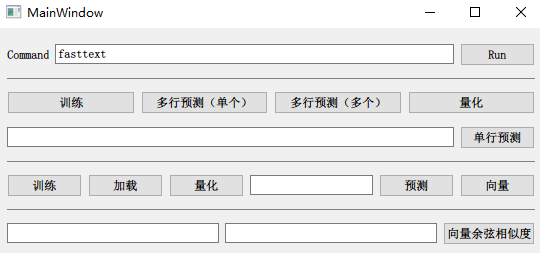

Qt-fastText
===

将fastText源码嵌入到Qt工程中，在运行的时候直接调用（原本是通过命令行调用）

例如循环输入，改为读取文件，即增加一个命令行参数为文件路径

> 命令参考：https://github.com/facebookresearch/fastText

---

### 解决控制台UTF-8乱码

```
chcp 65001
```

---

## 单词表示学习

```
fasttext skipgram -input data.txt -output model
```

参考[这里](https://github.com/facebookresearch/fastText#enriching-word-vectors-with-subword-information)，`data.txt`使用`UTF-8`编码，最终生成`model.bin`和`model.vec`文件

## 获取词向量

上面的模型可用于计算词汇外单词的词向量：

```
fasttext print-word-vectors model.bin < queries.txt
```

> 控制台中，`> queries.txt` 可不写，则可以在控制台输入多组数据
>
> 本程序可视化界面的命令行中（因为只能传文件），**不用写`>`，下同**

## 文本分类

### 监督

```
fasttext supervised -input train.txt -output model
```

`train.txt` 包含了要训练的大量句子，一行一个label与一条句子（中文要先分词），其中label以`__label__`开头。会输出`model.bin`和`model.vec`文件。

### 测试

训练完模型后，使用以下包含 `k`(P@k和R@k)的命令行 来评估它的精度和召回率。`k`是可选的，表示标签数量，默认为1。

```
fasttext test model.bin test.txt 1
```

### 预测

获取`k`个最有可能的标签，使用以下命令（中文要先分词）：

```
fasttext predict model.bin text.txt 1
```

附带概率：

```
fasttext predict-prob model.bin text.txt 1
```

`text.txt`一行一个句子（中文要先分词），结果输出每一行的k个标签，以及概率。

### 向量表示

如果要计算句子或段落的向量表示，可使用和之前一样的命令行：

```
fasttext print-sentence-vectors model.bin < text.txt
```

输出结果对应每行一个向量（一连串小数）

### 量化

使用以下命令量化监督模型以减少其内存使用量：

```
fasttext quantize -output model
```

> 由于代码里面写了-output必须要有-input，所以使用下面的命令行，input文件名任意：
>
> ```
> fasttext quantize -output model -input x
> ```

这会创建一个占用较小内存的`.ftz`文件。所有标准功能（如测试或预测）在量化模型上的工作方式均相同，例如：

```
fasttext test model.ftz test.txt
```


# GUI



## 命令行部分

直接执行FastText命令行

> 其中需要使用控制台输入的部分，改为使用 `> 文件名`

## 静态方法部分

`FastTextUtil类`

适用于只执行一次（比如训练）的地方

任何预测前都会重新加载模型，支持多线程

完全等同于控制台，只是多了可视化界面

### 面向对象部分

`FastTextObject类`

声明一个对象，单词加载模型，多次预测，或者切换模型

## 向量部分

用来测试句子向量的